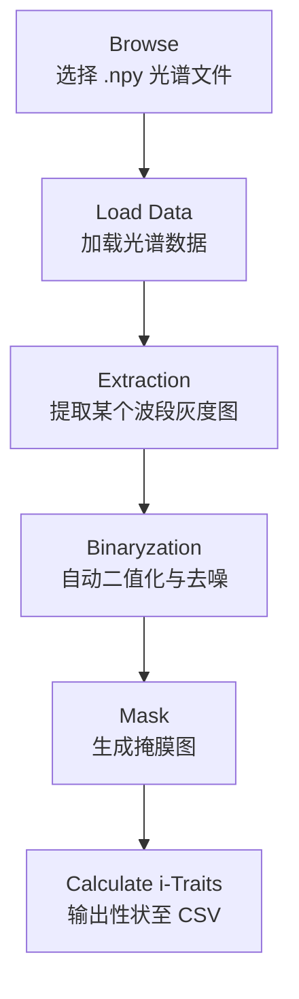

# 🌈 Hyperspectral Trait Extraction Tool  

基于 PyQt5 的光谱图像可视化、分割与性状（i-Traits）提取工具

本项目提供一个用于 **高光谱图像处理、区域分割及光谱性状计算** 的桌面应用。  
用户可加载 `.npy` 格式的三维高光谱数据，通过 GUI 完成可视化、二值化、掩膜生成，并将计算得到的光谱性状导出为 CSV。

---

## 📂 项目结构

│── HSI_window.py # PyQt5 界面文件(由 .ui 自动生成)

│── HSIProcessing.py # 光谱性状计算核心函数(光谱指数、多阶导数)

│── resource_file_rc.py # 资源文件

│── main.py # 主程序，负责事件绑定、图像显示及处理流程控制

---

## ✨ 功能概述

### ✔ 1. 加载光谱数据

- 输入：`.npy` 三维数组，形状为 `(H, W, Bands)`
- 程序将数据显示为可选波段的灰度图

### ✔ 2. 光谱图像提取

- 用户通过 Band 选择器选择某一光谱波段
- 该波段会被正规化并显示为灰度图

### ✔ 3. 自动二值化分割（Otsu）

包括若干预处理：

- 去除过曝值（TOP 1% 以上像素置零）
- 自动阈值分割
- 去除小连通区域

### ✔ 4. 掩膜生成

- 根据二值化结果生成掩膜
- 被遮罩区域以灰度图形式显示

### ✔ 5. 光谱性状计算（i-Traits）

由 `HSIProcessing.py` 完成，包括：

#### 📌 计算内容  

- **A**：各波段平均反射率  
- **dA**：一阶中心导数  
- **ddA**：二阶中心导数  
- **lgA**：log10 转换  
- **常见光谱指数（20 种）**  

## 🌱 光谱指数列表 (Spectral Index List)

| **缩写**    | **英文名称**                                | **中文名称**             | **公式**                                                                                              |
|-------------|---------------------------------------------|--------------------------|-------------------------------------------------------------------------------------------------------|
| **NDVI**    | Normalized Difference Vegetation Index      | 归一化植被指数             | $\text{NDVI} = \frac{R_{\text{NIR}} - R_{\text{RED}}}{R_{\text{NIR}} + R_{\text{RED}}}$         |
| **SR**      | Simple Ratio                                | 简化比值指数              | $\text{SR} = \frac{R_{\text{NIR}}}{R_{\text{RED}}}$                                               |
| **EVI**     | Enhanced Vegetation Index                   | 增强型植被指数            | $\text{EVI} = 2.5 \times \frac{R_{\text{NIR}} - R_{\text{RED}}}{R_{\text{NIR}} + 6 \times R_{\text{RED}} - 7.5 \times R_{\text{BLUE}} + 1}$ |
| **ARVI**    | Atmospherically Resistant Vegetation Index  | 大气阻抗植被指数          | $\text{ARVI} = \frac{R_{\text{NIR}} - (2 \times R_{\text{RED}} - R_{\text{BLUE}})}{R_{\text{NIR}} + (2 \times R_{\text{RED}} - R_{\text{BLUE}})}$ |
| **PRI**     | Photochemical Reflectance Index             | 光化学反射指数            | $\text{PRI} = \frac{R_{\text{570}} - R_{\text{531}}}{R_{\text{570}} + R_{\text{531}}}$           |
| **SIPI**    | Structure Insensitive Pigment Index         | 结构不敏感色素指数        | $\text{SIPI} = \frac{R_{\text{800}} - R_{\text{445}}}{R_{\text{800}} + R_{\text{445}}}$           |
| **CRI1**    | Carotenoid Reflectance Index 1              | 类胡萝卜素反射指数1       | $\text{CRI1} = \frac{1}{R_{\text{510}}} - \frac{1}{R_{\text{550}}}$                              |
| **CRI2**    | Carotenoid Reflectance Index 2              | 类胡萝卜素反射指数2       | $\text{CRI2} = \frac{1}{R_{\text{510}}} - \frac{1}{R_{\text{700}}}$                              |
| **ARI1**    | Anthocyanin Reflectance Index 1             | 花青素反射指数1           | $\text{ARI1} = \frac{1}{R_{\text{550}}} - \frac{1}{R_{\text{700}}}$                              |
| **ARI2**    | Anthocyanin Reflectance Index 2             | 花青素反射指数2           | $\text{ARI2} = R_{\text{800}} \times \left(\frac{1}{R_{\text{550}}} - \frac{1}{R_{\text{700}}}\right)$ |
| **REP**     | Red-edge Position Index                     | 红边位置指数              | $\text{REP} = \text{argmax}\left( \frac{d}{dx} \left( R_{\text{NIR}} - R_{\text{RED}} \right) \right)$ |
| **VOG1**    | Vogelmann Red-edge Index 1                  | Vogelmann 红边指数1       | $\text{VOG1} = \frac{R_{\text{740}}}{R_{\text{720}}}$                                            |
| **VOG2**    | Vogelmann Red-edge Index 2                  | Vogelmann 红边指数2       | $\text{VOG2} = \frac{R_{\text{734}} - R_{\text{747}}}{R_{\text{715}} + R_{\text{726}}}$          |
| **VOG3**    | Vogelmann Red-edge Index 3                  | Vogelmann 红边指数3       | $\text{VOG3} = \frac{R_{\text{734}} - R_{\text{747}}}{R_{\text{715}} + R_{\text{720}}}$          |

---

### 📌 输出格式

- 第一行：性状名称（header）  
- 第二行：对应数值  
- 保存为 `.csv`

---

## 🖥 程序界面流程图



---

## ▶️ 运行方法

```bash
python main.py
---

## 📦 依赖环境

### Python 版本

Python 3.x

### 所需库

numpy
opencv-python
PyQt5
使用以下命令安装：

```bash
pip install numpy opencv-python PyQt5
```

## ▶️ 运行方法

```bash
python main.py
```

